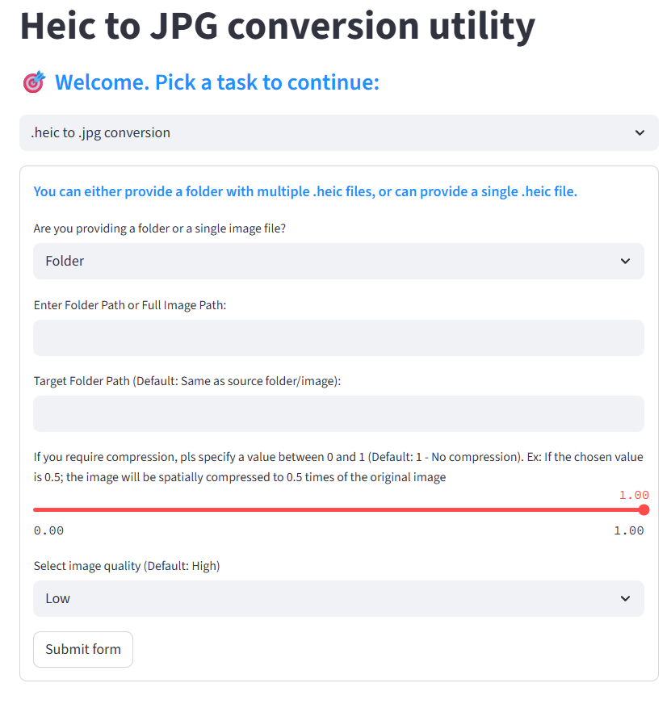

# HeicToJpegConversionUtility
Converts .heic images to .jpg images. Provides compression support as well as image quality control to keep the overall image size in check.

# How to run:  
Syntax: python -m streamlit run main.py

Runs in http://localhost:8501/.

# How it works?
Uses PILLOW library and extracts bytes data. Once extracted, size is modified in case user specifies compression. Image quality is another factor that controls the size. Based on both these factors, final jpg file is created.

# UI Screenshot:

